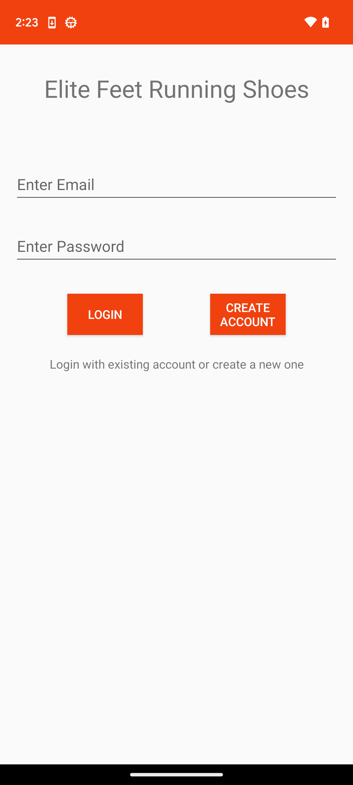
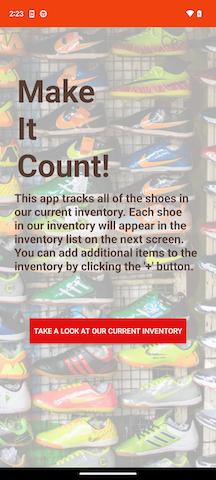
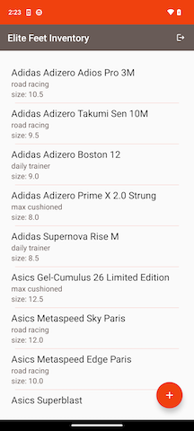
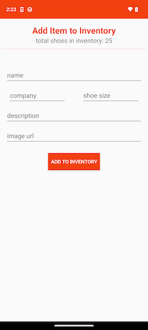

# Elite Feet Running Shoe Inventory App

## Getting Started

You should be able to run this app from within Android Studio using Android Gradle Plugin version 7.3.1, Gradle version 7.5,
and Java version 17

### Dependencies

This project uses the following dependencies:
- AndroidX core
- AndroidX appcompat
- AndroidX constraintLayout
- AndroidX navigation
- AndroidX lifecycle (livedata, viewmodel)
- AndroidX fragment
- Google material
- JakeWharton timber

## Project Instructions

Running this project will launch the Login Screen. This screen contains two editable fields for email and password. There is no
input validation for these fields. There are two buttons: Login and Create Account. For now, these two buttons navigate the user to the
Onboarding Screen.

 

The Onboarding Screen contains a welcome to the app and a button that navigates the user to the Instructions Screen.

 

The Instructions Screen contains a brief description of the list view and how to add another shoe to the inventory. The button navigates the user to the Inventory List Screen.

 

The Inventory List Screen contains a list of the current inventory in a ScrollView. Each item shows the company, the model, a description, and the size of the shoe. There is a toolbar icon that logs the user out of the app. There is also a FAB that navigates the user to the Detail Screen. The ScrollView gets the shoe list from the ViewModel as LiveData.

 

The Detail Screen is where the user can add items to the inventory. At the top there is a message indicating the number of shoes in the current inventory. This information is retrieved from the ViewModel via LiveData. Under that, all the fields are presented for the user to add another item to the shoe inventory. These fields have validation for correct values. The 'Add to inventory' button adds this item to the shoe list, which is updated in the Inventory List Screen as well as the 'total shoes in inventory' TextView at the top of this page. The user is navigated back to the Inventory List Screen after adding the item to inventory.

 
